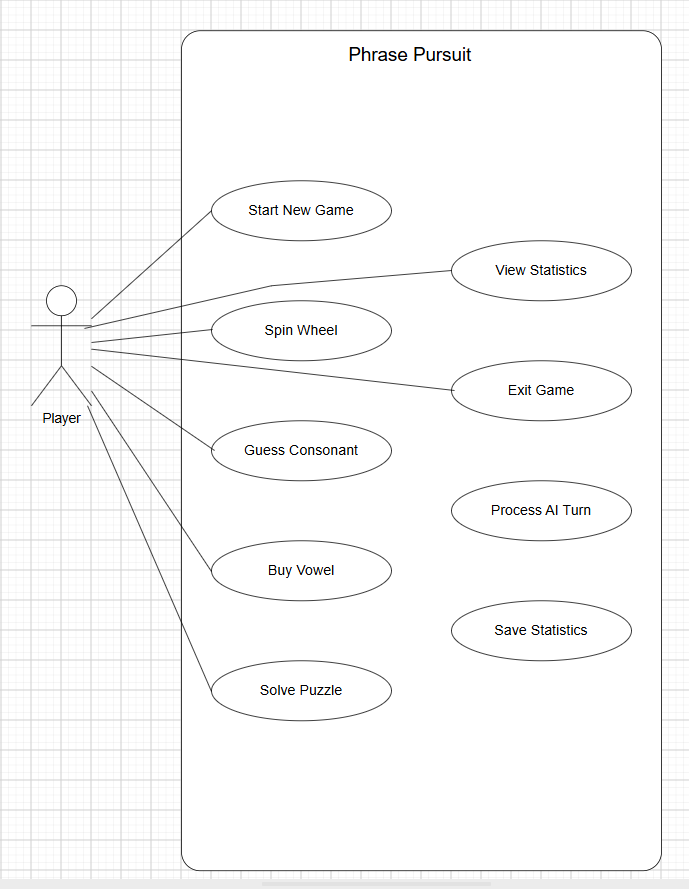
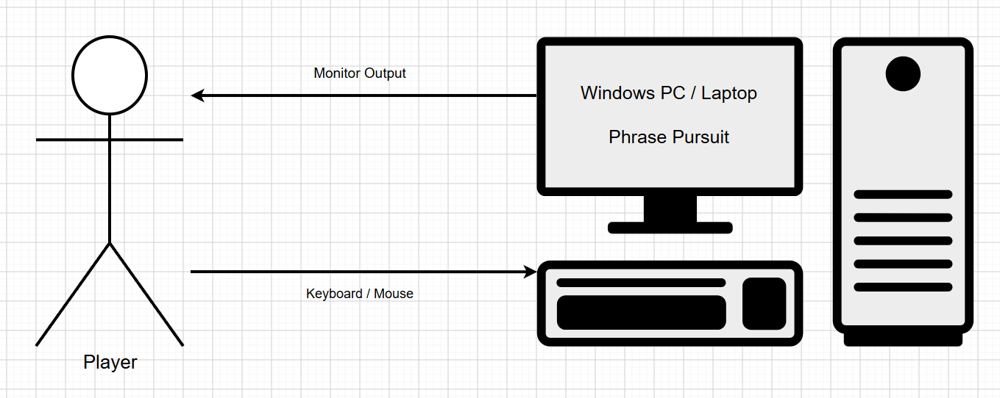
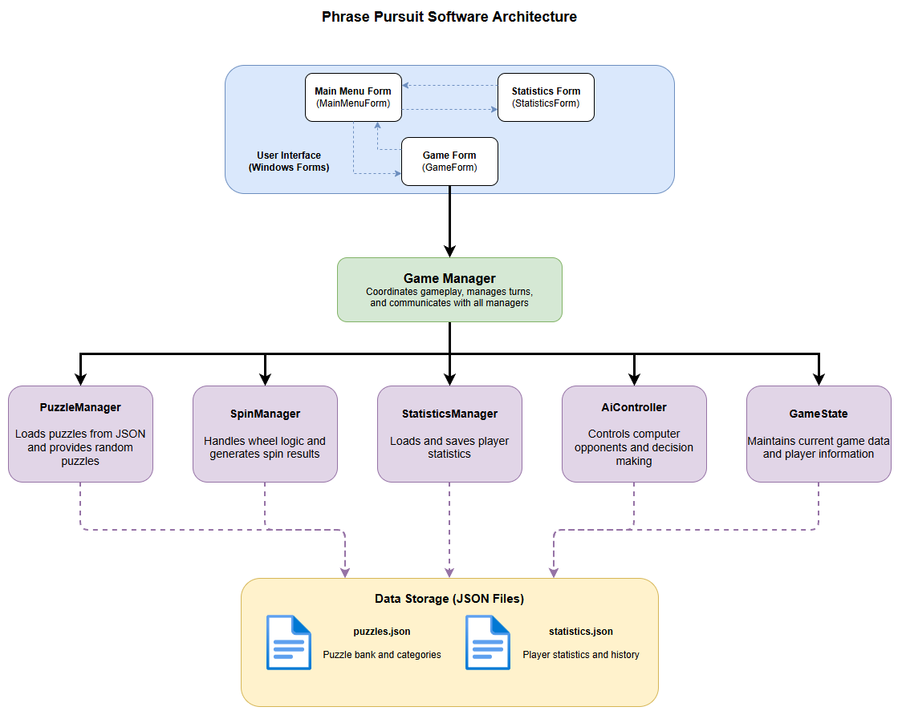
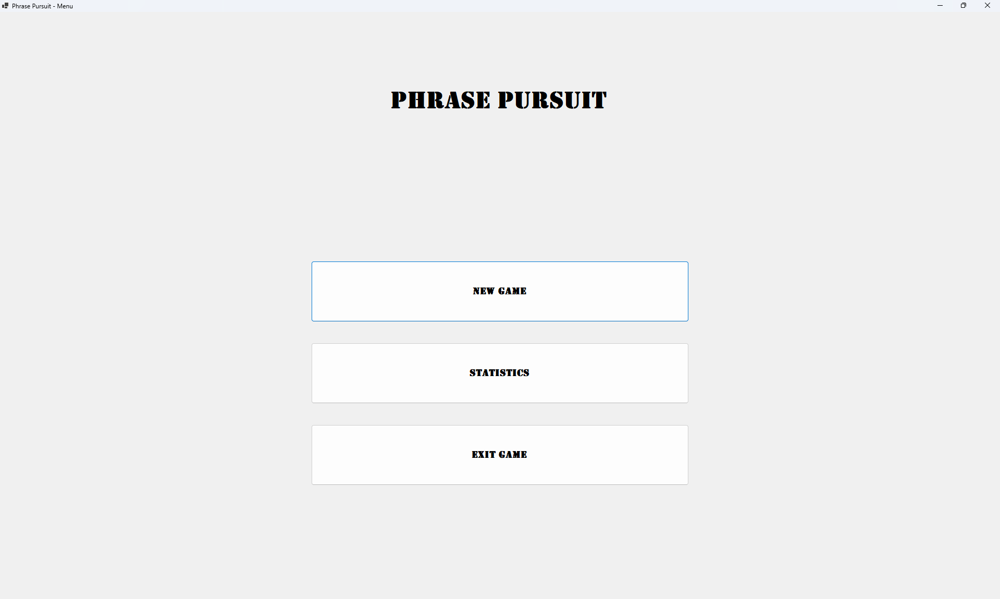
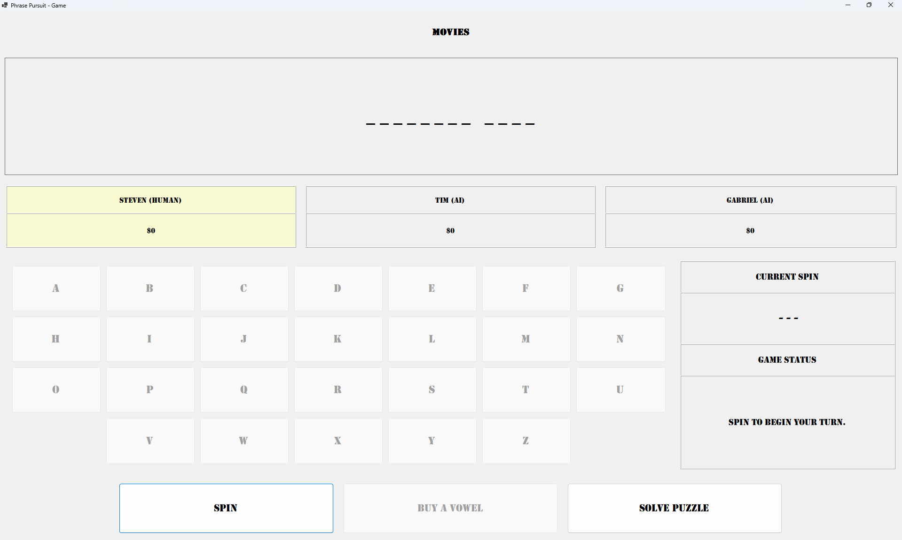
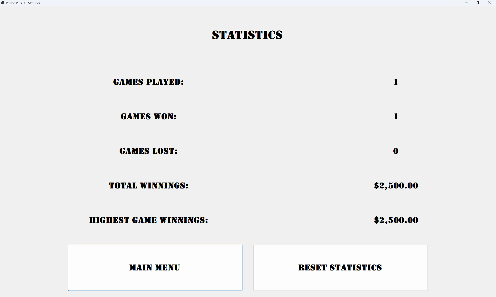

## Introduction / Project Summary

Phrase Pursuit is a standalone desktop application developed in C# using Windows Forms and the .NET 10 framework. Inspired by the television game show *Wheel of Fortune*, the application allows one human player to compete against two computer-controlled opponents by spinning a simulated wheel, guessing letters, purchasing vowels, and attempting to solve randomly selected word puzzles. The project was developed as an individual course project for CSC272 – Principles of System Design and followed the Incremental Software Development Life Cycle from initial planning through final implementation.

The primary objective of the project was to apply the software engineering principles covered throughout the course to the development of a complete software application. The project incorporated object-oriented design, event-driven programming, persistent data storage using JSON, probability-based computer opponents, and version control through Git and GitHub. Development was organized into multiple increments, allowing major components such as the user interface, game managers, computer-controlled opponents, and statistics system to be implemented and tested individually before being integrated into the final application.

The completed application includes a responsive graphical user interface, randomized puzzle selection, animated wheel spins, probability-based computer opponents, persistent player statistics, and comprehensive gameplay testing. Although several optional enhancements were identified for future development, the final product successfully met the functional requirements established during the planning phase and demonstrates the complete software development process from requirements analysis through testing and deployment.

## Objectives

The primary objective of Phrase Pursuit was to design and develop a fully functional desktop application that demonstrates the software engineering and object-oriented programming concepts covered throughout the course. Rather than creating a simple proof-of-concept, I wanted to build a complete application that users could actually play while applying concepts such as class design, encapsulation, event-driven programming, data persistence, and user interface development.

A second objective was to gain experience organizing a larger software project using the Incremental Software Development Life Cycle. The project was intentionally divided into multiple phases, allowing the user interface, supporting manager classes, gameplay logic, and testing to be developed and integrated incrementally. Version control through Git and GitHub was used throughout development to manage feature branches, track progress, and merge completed functionality into the main project.

Finally, I wanted to improve my own programming skills by implementing concepts that I had limited experience with before beginning the project. These included JSON serialization, asynchronous programming using async and await, and coordinating communication between multiple classes while maintaining separation of concerns. Completing the project provided practical experience with these concepts while producing an application that can serve as both a portfolio project and a foundation for future enhancements.

## Overview

Phrase Pursuit is a standalone desktop application developed by Steven Scoville as an individual project for CSC272 – Principles of System Design. The application was created using C#, Windows Forms, and the .NET 10 framework to demonstrate the software engineering principles and object-oriented programming concepts studied throughout the course. Inspired by the television game show *Wheel of Fortune*, the game challenges one human player to compete against two probability-based computer-controlled opponents by solving randomly selected word puzzles.

Although the project was developed as a course assignment, it was designed to resemble a complete software application rather than a simple programming exercise. Throughout development, the project followed the Incremental Software Development Life Cycle, allowing individual components to be designed, implemented, tested, and integrated in stages. The intended customers for the completed application are end users who enjoy word puzzle games and are looking for an engaging desktop game that can be played repeatedly with persistent player statistics.

## System Description

Phrase Pursuit is a Windows Forms desktop application that simulates a word puzzle game in which one human player competes against two probability-based computer-controlled opponents. The application manages the complete gameplay experience, including player turns, wheel spins, letter guessing, puzzle solving, scoring, and persistent player statistics. Randomly selected puzzles are loaded from an external JSON file, allowing new puzzles to be added without modifying the application's source code.

The application follows an object-oriented architecture that separates responsibilities across multiple classes. User interaction is handled through the graphical interface, while the game logic is managed by specialized classes such as the GameManager, PuzzleManager, SpinManager, StatisticsManager, and AiController. Supporting model classes store information such as players, puzzles, game state, spin results, and guess results. This separation of concerns improves maintainability, simplifies testing, and makes it easier to extend the application with additional features in the future.

Player statistics, including games played, wins, losses, lifetime winnings, and highest winnings, are stored using JSON serialization so that progress is preserved between application sessions. Throughout gameplay, the system validates user input, updates the user interface based on the current game state, and coordinates interactions between the human player and computer-controlled opponents to provide a smooth and responsive gameplay experience.

## System Requirement

The system requirements for Phrase Pursuit were established during the planning phase and served as the foundation for the application's design and implementation. Functional requirements focused on the gameplay experience, while non-functional requirements addressed usability, performance, maintainability, and data persistence. These requirements were used throughout development to guide implementation and verify that the completed application met the intended objectives.

The primary functional requirements included allowing a human player to compete against two probability-based computer-controlled opponents, generating random puzzles from an external JSON file, spinning a simulated wheel to determine consonant values, purchasing vowels, solving puzzles, and tracking player winnings throughout each game. The application was also required to maintain persistent player statistics, including games played, wins, losses, lifetime winnings, and highest winnings, so that player progress would be preserved between application sessions.

Non-functional requirements emphasized creating an intuitive graphical user interface that was responsive and easy to use while maintaining a modular object-oriented architecture. The application was required to separate user interface responsibilities from gameplay logic through the use of manager and model classes, allowing individual components to be developed and maintained independently. Additional requirements included validating user input, handling invalid gameplay actions gracefully, and providing a consistent user experience through status messages, animations, and persistent data storage.

## Major Feature Specifications

### Gameplay

The primary feature of Phrase Pursuit is a complete single-player word puzzle experience in which one human player competes against two probability-based computer-controlled opponents. Players spin a simulated wheel to determine the value of consonant guesses, purchase vowels using accumulated winnings, and attempt to solve randomly selected phrases. Correct consonant guesses award money and allow the player to continue their turn, while incorrect guesses, vowel purchases (whether correct or not), bankrupt spins, and lose-turn spins pass control to the next player. The game continues until one player correctly solves the puzzle.

### Computer-Controlled Opponents

The application includes two computer-controlled opponents that make gameplay decisions based on configurable probabilities. During each turn, the computer player decides whether to spin the wheel, purchase a vowel, or attempt to solve the puzzle. Letter selections are based on remaining available letters, while puzzle-solving attempts become more likely as additional letters are revealed. Thinking delays and animated wheel spins were implemented to provide a more natural gameplay experience and improve the overall presentation of the game.

### Puzzle Management

Puzzles are stored externally in a JSON file, allowing additional puzzles to be added without modifying the application's source code. Each puzzle includes both a category and a phrase, which are loaded into memory at runtime. At the start of each game, the application randomly selects a puzzle and automatically reveals spaces and punctuation while requiring players to guess alphabetic characters.

### Statistics Management

The application maintains persistent player statistics across multiple gameplay sessions. Statistics include games played, wins, losses, lifetime winnings, and the highest winnings earned during a single game. These statistics are stored using JSON serialization and are displayed through a dedicated statistics screen, where users may also reset their saved statistics if desired.

### User Interface

The graphical user interface was developed using Windows Forms and consists of a main menu, gameplay screen, player name dialog, puzzle-solving dialog, and statistics screen. Throughout gameplay, the interface updates dynamically to display the current puzzle, player winnings, active player, available letters, wheel results, and gameplay status messages. Buttons are enabled or disabled automatically based on the current phase of the game to prevent invalid user actions and guide the player through each turn.

## System Diagrams

A UML Use Case Diagram was created during the planning phase of the project to identify the primary interactions between the player and the application. Developing the diagram before implementation helped define the functional requirements from the user's perspective and ensured that the major gameplay features were considered before development began.

The Use Case Diagram illustrates the actions available to the player, including starting a new game, spinning the simulated wheel, guessing consonants, purchasing vowels, attempting to solve puzzles, viewing player statistics, and exiting the application. Throughout development, the diagram served as a reference to verify that the completed application supported the functionality originally identified during the analysis and design phases of the project.

**Figure 1**  
*Phrase Pursuit Use Case Diagram*

## Hardware Overview Diagram

The hardware requirements for Phrase Pursuit are minimal because the application executes entirely on a single Windows computer. The player interacts with the application using a standard keyboard and mouse while the graphical user interface is displayed on the computer's monitor. All gameplay logic, puzzle management, statistics, and data storage are processed locally, eliminating the need for specialized hardware, external devices, or network connectivity.

Figure 2 illustrates the basic hardware environment required to run the application. The player provides input through the keyboard and mouse, while the application processes gameplay and displays the results through the Windows Forms user interface. Since all game data is stored locally, the application can be used without an internet connection once it has been installed.

**Figure 2**  
*Hardware Overview Diagram*

## Software Overview Diagram

The Phrase Pursuit software architecture is organized into several layers that separate the user interface, game logic, and data management. The Windows Forms user interface provides the interaction between the player and the application, while the GameManager coordinates gameplay and communicates with the supporting manager classes responsible for puzzle selection, wheel spins, computer opponent behavior, and persistent player statistics.

Supporting manager classes each perform a specific responsibility within the application. The PuzzleManager loads puzzles from a JSON file, the SpinManager generates wheel outcomes, the StatisticsManager saves and loads player statistics, and the AiController determines the actions performed by the probability-based computer opponents. This separation of responsibilities improves maintainability, reduces coupling between components, and simplifies future enhancements to the application.

The application stores puzzle data and player statistics in external JSON files, allowing content and saved data to be updated without requiring changes to the application's source code. Figure 3 illustrates the high-level relationships between the major software components that make up the completed application.

**Figure 3**  
*Software Overview Diagram*

## Economical, Technical, Time, and Constraints

Several constraints affected the development of Phrase Pursuit throughout the project. From an economic perspective, the project was completed using software and tools that were either freely available or provided through educational licensing. Development was performed using Visual Studio Community Edition, Git, GitHub, and draw.io, allowing the project to be completed without incurring additional software costs. The application also requires only standard consumer computer hardware to run, making it inexpensive for end users to use.

The primary technical challenge involved integrating the various components of the application into a cohesive system. Although many of the supporting classes, such as the puzzle manager, statistics manager, spin manager, and user interface, were developed independently, connecting them through the GameManager required careful coordination. Another significant challenge was implementing asynchronous gameplay behavior using async and await to allow the computer-controlled opponents to simulate thinking and wheel spin animations without causing the user interface to become unresponsive. This required additional research and multiple rounds of testing before the implementation functioned as intended.

Time was the greatest project constraint. Balancing coursework with family responsibilities, childcare, medical appointments, and ongoing back issues significantly reduced the amount of uninterrupted development time available each week. As a result, several development sessions extended late into the night in order to complete planned milestones. Although the project required considerably more time than originally estimated, maintaining an incremental development approach allowed major components to be completed individually before being integrated into the final application. As deadlines approached, development priorities shifted toward completing and thoroughly testing the application's core functionality. While there were several user interface enhancements and quality-of-life improvements that I had originally planned to implement, they were deferred in order to ensure that the finished application met all functional requirements and provided a stable gameplay experience.

Despite these challenges, each constraint was addressed through careful planning, iterative testing, and continuous refinement. Breaking the project into smaller development tasks made it possible to identify and resolve issues incrementally, ultimately resulting in a fully functional application that met the project's original objectives.

## Hardware Detailed Implementation

Phrase Pursuit was developed and tested using standard consumer computer hardware running the Windows operating system. Because the application is a Windows Forms desktop application, it does not require dedicated servers, specialized peripherals, or high-performance computing hardware. All game logic, user interface rendering, and data storage are processed locally on the user's computer.

The only hardware required to run the application is a Windows-based desktop or laptop computer equipped with a keyboard, mouse, and monitor. User input is provided through the keyboard and mouse, while the graphical user interface presents the game's menus, puzzle board, player information, and status messages. Puzzle data and player statistics are stored locally as JSON files on the computer's storage device, allowing the application to function without an internet connection.

During development, no additional hardware components or external devices were required. The application's lightweight design makes it suitable for a wide range of modern Windows computers while maintaining responsive gameplay and a consistent user experience.

## Software Detailed Implementation

Phrase Pursuit was developed using C# with the .NET 10 framework and Windows Forms in Microsoft Visual Studio Community Edition. The application follows an object-oriented design that separates the graphical user interface from the underlying game logic. Individual responsibilities are divided among specialized manager classes that coordinate gameplay, puzzle management, wheel spins, player statistics, and computer-controlled opponent behavior. This modular design improves maintainability and allows individual components to be modified or extended with minimal impact on the rest of the application.

Application data is stored using JSON files and is accessed through dedicated manager classes. Puzzle categories and phrases are loaded from an external JSON file at the beginning of each game, while player statistics are serialized and saved automatically when a game is completed. This approach allows both game content and player progress to persist between application sessions without requiring a database or external storage service.

Version control was managed throughout development using Git and GitHub. New functionality was developed on feature branches before being merged into the main project after testing was complete. This workflow made it possible to isolate individual features, track development progress, and safely incorporate changes as the project evolved. Additional development tools, including draw.io for system diagrams and GitHub for source code management, were used throughout the software development process.

## Test/Evaluation Experimental Procedure and Analysis of Results

Testing was performed throughout the development process using an incremental approach in which each major component was verified individually before being integrated into the completed application. Initial testing focused on validating the functionality of individual manager classes, including puzzle loading, wheel spin generation, player statistics, and computer-controlled decision making. Once these components were functioning correctly, they were integrated through the GameManager, and additional testing was performed to verify that the overall game flow behaved as expected.

Comprehensive gameplay testing was conducted after the primary game mechanics had been implemented. Multiple games were played to verify player turn progression, wheel spin outcomes, consonant and vowel guessing, puzzle solving, score calculation, and end-of-game behavior. Special attention was given to edge cases such as bankrupt spins, lose-turn outcomes, repeated letter guesses, invalid player actions, and game completion. Player statistics were also tested to ensure that games played, wins, losses, lifetime winnings, and highest winnings were correctly recorded and persisted between application sessions.

Several issues were identified during testing and corrected before the project was completed. These included problems with turn progression, asynchronous computer opponent behavior, gameplay status messages, and statistics persistence. Each issue was resolved through debugging and repeated testing until the expected behavior was achieved. The completed application successfully satisfied the functional requirements established during the planning phase and provided a stable, fully playable user experience.

Figures 4 through 6 demonstrate the completed application during various stages of gameplay, including the main menu, active gameplay, and the statistics screen.

**Figure 4**  
*Main Menu*

**Figure 5**  
*Gameplay Screen*

**Figure 6**  
*Statistics Screen*

## Societal Impact of Project Including Legal and Ethical Considerations

The primary societal impact of Phrase Pursuit is to provide an enjoyable and accessible word puzzle game that encourages critical thinking, spelling, vocabulary development, and problem-solving skills. Although the application was developed primarily as an educational software engineering project, it demonstrates how desktop applications can be designed to provide entertainment while reinforcing cognitive skills. The game's straightforward interface and locally stored data also make it accessible to a wide range of users without requiring an internet connection or online account.

The project presents very few legal or ethical concerns because it does not collect personal information, transmit user data over a network, or interact with external services. Player statistics are stored locally on the user's computer and consist only of gameplay information, eliminating concerns related to user privacy or data security. Because the application is intended solely for entertainment, it also avoids ethical issues associated with financial transactions, sensitive information, or decision-making systems that could affect users in meaningful ways.

One legal consideration during development was respecting intellectual property. Although Phrase Pursuit was inspired by the gameplay mechanics of *Wheel of Fortune*, the project was developed as an original educational application using original source code, a unique title, independently created artwork and user interface elements, and a custom collection of puzzle data. Care was taken to avoid reproducing copyrighted assets or presenting the application as an official adaptation of the television game show.

## Conclusions

Phrase Pursuit successfully achieved the objectives established during the planning phase of the project. The completed application demonstrates the software engineering principles and object-oriented programming concepts studied throughout the course while providing a fully playable desktop game. By following the Incremental Software Development Life Cycle, individual components were developed, tested, and integrated in manageable stages, resulting in a stable and maintainable application.

Throughout development, I gained practical experience applying concepts such as object-oriented design, event-driven programming, JSON serialization, asynchronous programming, version control, and software testing. Several technical challenges arose during implementation, particularly when integrating the various manager classes and implementing asynchronous computer opponent behavior. Resolving these challenges strengthened my understanding of software architecture and reinforced the importance of iterative development and thorough testing.

Overall, I am satisfied with the outcome of the project. Phrase Pursuit met the functional requirements identified during the analysis and design phases while providing a solid demonstration of the complete software development process. Beyond fulfilling the course requirements, the project has also strengthened my confidence in designing and implementing larger software applications and has provided valuable experience that I can apply to future software development projects.

## Recommendations for Future Work

Although Phrase Pursuit meets the objectives established for this project, several enhancements could improve the application's functionality and overall user experience. One possible improvement would be expanding the puzzle library with additional categories and a larger collection of phrases to increase replayability. Additional gameplay options, such as selectable difficulty levels for the computer-controlled opponents, customizable player settings, and configurable game rules, could also provide a more personalized experience.

The user interface could be further refined through visual enhancements such as improved color schemes, scalable fonts, additional animations, and sound effects. While the current interface provides all of the functionality required to play the game, these improvements would create a more polished and engaging experience. Another useful enhancement would be allowing players to immediately begin a new game after completing a puzzle instead of returning to the main menu.

Additional improvements could include more sophisticated decision-making for the computer-controlled opponents, expanded gameplay statistics, and optional accessibility features to improve usability for a wider range of players. Although these features were beyond the scope of the current project, the modular architecture of the application provides a strong foundation for continued development and future enhancements. Because the application was designed using a modular object-oriented architecture, many of these enhancements could be implemented without requiring significant changes to the existing codebase.

## Appendices

### Customer Contact Information

The intended customers for Phrase Pursuit are individual users who enjoy word puzzle games and educational desktop applications. Because the project was developed as an individual academic project rather than for a specific client, there is no customer organization or external stakeholder associated with the application. The software was designed to be suitable for any Windows user interested in a casual single-player word game.

### Software Installation Instructions

Phrase Pursuit is distributed as a Windows desktop application. To install the software, the user should download or copy the application files to a Windows computer and run the executable file included with the release. The application requires the accompanying JSON data files, which store the puzzle library and player statistics, to remain in the appropriate application directory. No additional configuration or internet connection is required after installation.

### User's Manual

To begin using Phrase Pursuit, launch the application and select New Game from the main menu. Enter a player name when prompted to begin a game. During gameplay, players may spin the wheel, purchase vowels, or attempt to solve the puzzle using the buttons provided on the game screen. The game automatically manages player turns, computer-controlled opponents, scoring, and puzzle progression. After a game has been completed, players may return to the main menu or view their lifetime statistics from the Statistics screen. The Statistics screen also provides an option to reset all saved statistics.

### Acknowledgments

I would like to thank Professor Cordle for providing guidance and feedback throughout the duration of this project. I would also like to acknowledge the documentation provided by Microsoft, which was an invaluable resource while researching Windows Forms, C#, JSON serialization, and asynchronous programming concepts. Finally, I appreciate the support of my family throughout the quarter, whose patience and encouragement made it possible for me to complete this project despite several personal and scheduling challenges.

## References

Microsoft. (n.d.-a). *StringBuilder class (System.Text).* Microsoft Learn. Retrieved July 17, 2026, from https://learn.microsoft.com/en-us/dotnet/api/system.text.stringbuilder?view=net-10.0

Microsoft. (n.d.-b). *TimeSpan Struct (System).* Microsoft Learn. Retrieved July 31, 2026, from https://learn.microsoft.com/en-us/dotnet/api/system.timespan?view=net-10.0

Microsoft. (2024, November 22). *Async return types - C#.* Microsoft Learn. https://learn.microsoft.com/en-us/dotnet/csharp/asynchronous-programming/async-return-types

Microsoft. (2025a, July 16). *Asynchronous programming in C#.* Microsoft Learn. https://learn.microsoft.com/en-us/dotnet/csharp/asynchronous-programming/

Microsoft. (2025b, November 19). *How to deserialize JSON in C# - .NET.* Microsoft Learn. https://learn.microsoft.com/en-us/dotnet/standard/serialization/system-text-json/deserialization