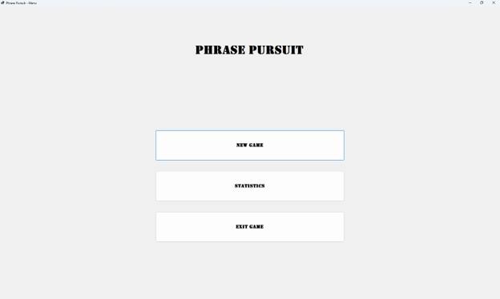
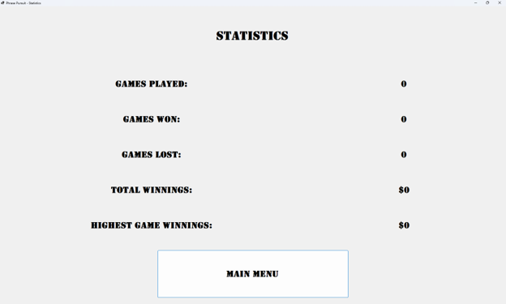
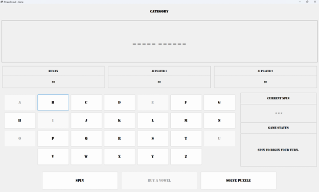

# 1. Introduction

## a. Purpose of the Product

Phrase Pursuit is a Wheel of Fortune-inspired word guessing game developed as a Windows Forms application in C#. The purpose of the game is to allow one human player to compete against two computer-controlled opponents by spinning a wheel, guessing letters, buying vowels, and solving word puzzles. The application is intended to demonstrate object-oriented programming concepts while providing an enjoyable and interactive gameplay experience.

## b. Scope of the Product

The application will manage all aspects of gameplay, including puzzle selection, wheel spins, player turns, score tracking, AI decisions, and persistent player statistics. Puzzle data will be stored in JSON files, allowing additional puzzles to be added without modifying the application's source code. The project is intended for educational purposes and will be developed using the Incremental Software Development Life Cycle.

## c. Project Team Members, Acronyms, Abbreviations, Definitions

### Project Team

- Steven Scoville – Developer

### Acronyms

- **SDLC** – Software Development Life Cycle
- **SRS** – System Requirements Specification
- **UI** – User Interface
- **AI** – Artificial Intelligence
- **JSON** – JavaScript Object Notation

### Definitions

- **Puzzle** – The word or phrase players attempt to solve.
- **Round** – One complete puzzle from beginning until solved.
- **Spin** – The action used to determine the value of a consonant guess.
- **Bankrupt** – A wheel result that resets the current player's round winnings to zero.

## d. References

Microsoft. (n.d.). *StringBuilder class (System.Text).* Microsoft Learn. Retrieved July 17, 2026, from https://learn.microsoft.com/en-us/dotnet/api/system.text.stringbuilder?view=net-10.0

Microsoft. (2025, November 19). *How to deserialize JSON in C# - .NET.* Microsoft Learn. https://learn.microsoft.com/en-us/dotnet/standard/serialization/system-text-json/deserialization

## e. Outline of the Rest of the SRS

The remainder of this document describes the overall system, user characteristics, functional requirements, performance requirements, and system constraints necessary to develop Phrase Pursuit.

# 2. General Description

## a. Context of Product

Phrase Pursuit is a standalone desktop application developed using C# and Windows Forms. The application does not require an internet connection and stores game data locally using JSON files. Users interact entirely through the graphical user interface.

## b. Product Functions

The application shall:

- Display a Main Menu.
- Start a new game.
- Randomly select a puzzle.
- Display the puzzle while hiding unrevealed letters.
- Allow players to spin the wheel.
- Allow players to guess consonants.
- Allow players to purchase vowels.
- Allow players to attempt to solve the puzzle.
- Manage player turns.
- Control AI player decisions.
- Track player winnings during each round.
- Save player statistics between sessions.
- Display cumulative statistics.

## c. User Characteristics

The application is intended for users who are familiar with basic computer operation, including using a mouse and keyboard. No prior knowledge of the game's implementation is required.

## d. Constraints

- Developed using C# and Windows Forms.
- Uses local JSON files for data storage.
- Designed for Windows operating systems.
- Single-player only (one human player versus two AI players).
- No online multiplayer functionality.

## e. Assumptions and Dependencies

The application assumes that the required JSON data files are present and readable. It also assumes the user is running the application on a Windows system capable of running .NET applications.

# 3. Specific Requirements

## a. External Interface Requirements

### i. User Interfaces

The application will include:

- Main Menu
- Game Screen
- Statistics Screen

The Game Screen will display:

- Puzzle category
- Puzzle board
- Three player panels
- Letter selection buttons
- Spin, Buy Vowel, and Solve buttons
- Status messages
- Current wheel result

### ii. Hardware Interfaces

- Standard mouse and keyboard input.
- Monitor capable of displaying the application window in at least 1280x720 resolution.

### iii. Software Interfaces

- Windows Forms
- .NET
- System.Text.Json

### iv. Communications Interfaces

None.

The application operates entirely offline.

## b. Functional Requirements

### Puzzle Management

The system shall:

- Load puzzles from a JSON file.
- Randomly select puzzles.
- Render hidden and revealed letters.
- Preserve spaces and punctuation.
- Determine whether guessed letters exist.
- Count letter occurrences.
- Determine when a puzzle has been solved.

### Gameplay Management

The system shall:

- Control player turns.
- Process wheel results.
- Award money for correct consonants.
- Allow vowel purchases.
- Handle bankrupt and lose-a-turn outcomes.
- Determine round winners.
- Update player scores.

### AI Management

The system shall:

- Control two AI opponents.
- Select letters.
- Attempt puzzle solves.
- Follow the same gameplay rules as the human player.

### Statistics Management

The system shall:

- Record games played.
- Record wins.
- Record losses.
- Save statistics to a JSON file.
- Load statistics when the application starts.

## c. Performance Requirements

### i. Design Constraints

The application should respond to user input immediately under normal operating conditions.

### ii. Quality Requirements

The application should:

- Respond quickly to user input without noticeable delays.
- Remain stable throughout gameplay without crashing or freezing.
- Contain a user interface that is clear and easy to navigate.
- Handle invalid user input gracefully with appropriate feedback.

### iii. Other Requirements

Puzzle and statistics data should remain editable without requiring recompilation of the application.

# 4. Appendices

## Screenshots

### Main Menu

### Statistics Screen

### Game Screen

