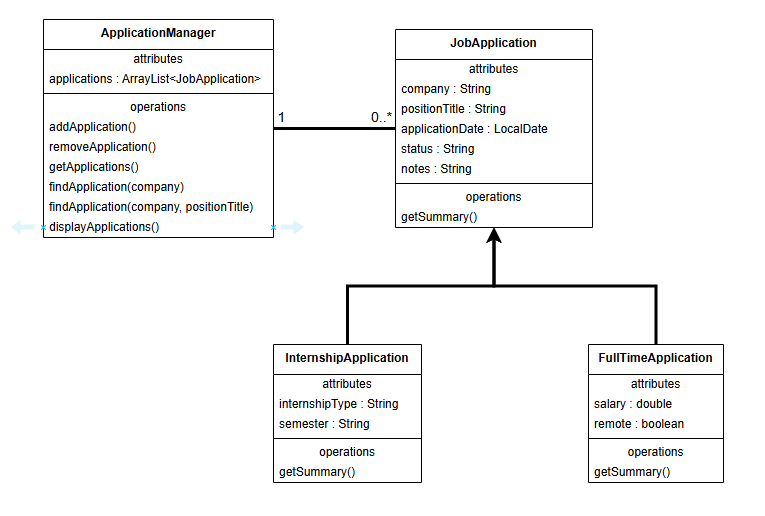

Job Application Tracker is a Java application I am currently developing to organize and manage job application information. I chose the project because it provides a practical way to apply object-oriented programming concepts to something directly related to my own career development. The application is being built as a Maven project and uses a structured package layout to separate application management from the underlying data models.

The project uses a base `JobApplication` class to represent information shared by all applications, including the company, position title, application date, status, and notes. `InternshipApplication` and `FullTimeApplication` extend the base class with information specific to each type of position. This structure has given me practical experience using inheritance and polymorphism to represent related objects without duplicating their shared functionality.

Application management is handled by a separate `ApplicationManager` class, which stores `JobApplication` objects in an `ArrayList`. The manager provides functionality for adding and removing applications, retrieving the collection, searching for applications, and displaying application summaries. The project also uses overloaded methods and constructors, allowing similar operations to accept different sets of information depending on how they are being used.

Before implementing the classes, I created a UML class diagram to plan the relationships between the application's components. Designing the class structure first helped me determine which information belonged in the base class, which responsibilities belonged in the manager, and how the specialized application types should inherit from the common model.

The project is still in development. The core model and application-management structure have been implemented, while the interactive application functionality and remaining features are still being built. As development continues, I plan to expand the application while maintaining the separation between the application's data models and management logic.

Source: <a href="https://github.com/SSCOVI8473/job-application-tracker"><i class="large github icon "></i>SSCOVI8473/job-application-tracker</a>