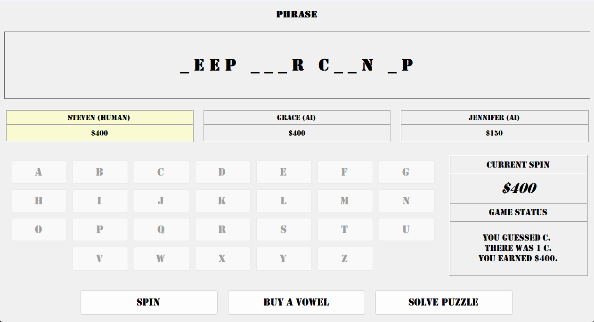

Phrase Pursuit is a desktop word puzzle game I developed in C# using Windows Forms. The game pits the player against two computer-controlled opponents as they take turns spinning for a value, guessing letters, buying vowels, and attempting to solve the puzzle. I wanted to build something more substantial than a typical class assignment while gaining more experience with object-oriented programming, application state, and user interface development.

The game includes multiple puzzle categories, randomized spin results, computer-controlled opponents with probability-based decision making, and persistent game statistics. Puzzle data and player statistics are stored in JSON files, allowing the game to load puzzle information and preserve statistics between sessions.

One of the biggest challenges I encountered while developing Phrase Pursuit was deciding how to separate the user interface from the underlying game logic. As the project grew, I began separating responsibilities into models and manager classes rather than allowing the Windows Form to handle everything. This gave me a better understanding of separation of concerns and showed me why application structure becomes increasingly important as a project grows.

Phrase Pursuit uses several classes to divide responsibilities such as game management, puzzle selection, spin results, player information, statistics, and computer-player behavior. Developing the project gave me experience designing classes that work together to manage a larger application instead of placing all of the program's functionality in one location.

I am currently using the desktop version of Phrase Pursuit as the foundation for a new web-based version built with Blazor. Rebuilding the game for the web is giving me an opportunity to revisit the original design, improve the separation between the game logic and user interface, and apply what I learned from developing the desktop version.

Source: <a href="https://github.com/SSCOVI8473/PhrasePursuit"><i class="large github icon "></i>SSCOVI8473/PhrasePursuit</a>