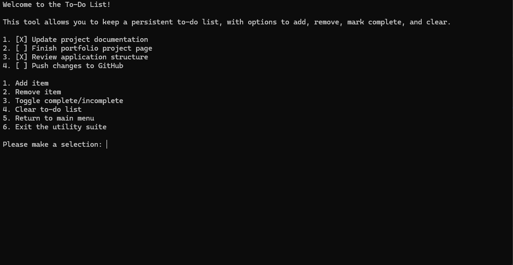

UtilitySuite is a C# console application I developed to combine several small utilities into a single menu-driven program. The application includes a tip calculator, temperature converter, word counter, and persistent to-do list. I originally built the individual tools to practice fundamental C# concepts, then brought them together into a larger application with a shared structure and navigation system.

As the project grew, I focused on keeping each utility independent while avoiding duplicated functionality. Shared input handling is separated from the individual tools, allowing them to use the same validation logic for user input. Navigation between the tools and the main menu is also handled consistently throughout the application.

The to-do list introduced file persistence to the project. Tasks are saved to disk and loaded when the application starts, allowing the list to remain available between sessions. The to-do functionality also separates the task data from the code responsible for saving and loading it.

UtilitySuite helped me understand how even relatively simple features can benefit from good application structure. Organizing the project into separate areas for shared functionality, navigation, persistence, and individual tools gave me experience designing classes around specific responsibilities instead of placing an entire console application inside a single program file.

Source: <a href="https://github.com/s-scoville/UtilitySuite"><i class="large github icon "></i>s-scoville/UtilitySuite</a>